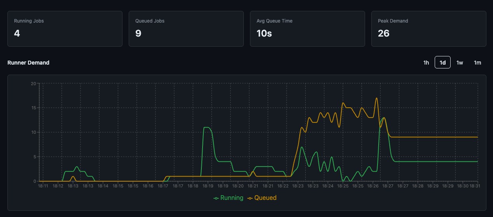

[](https://github.com/features/actions)
[](https://golang.org/)
[](https://www.docker.com/)

[](https://github.com/gateixeira/live-actions/issues)

# Live Actions - GitHub Actions Monitoring 🚀

> ⚠️ **Beta Software Notice**: Live Actions is currently in beta. While functional and actively developed, expect potential instabilities. Please report issues and provide feedback to help us improve!

Real-time monitoring for GitHub Actions workflows and runners. A single self-contained binary.

## Overview

**Live Actions** provides real-time monitoring and analytics for GitHub Actions workflows. It works with GitHub Enterprise Cloud and Server at Enterprise, Organization and Repository levels.

### 🎯 **Core Features**

#### **📊 Interactive Dashboard**
- Live visualization of runner demand with historical charts
- Configurable tracking for GitHub-hosted vs self-hosted runners
- Visual status for queued, running, completed, and failed jobs



#### **📋 Workflow Runs Management**
- Complete history of recent workflow executions with pagination
- Click to view individual job information for each workflow run
- Real-time status updates (queued, in_progress, completed, failed)


#### **🔴 Failure Analytics**
- Failure rate tracking with total failures, cancellations, and failure percentage
- Failure trend chart showing failures, successes, and cancellations over time
- Top failing jobs table ranked by failure count with direct links to GitHub

#### **🏷️ Runner Labels**
- Per-label demand breakdown showing which runner types (e.g., `ubuntu-latest`, `self-hosted`) have the most demand
- Job volume chart by label over time to identify demand patterns
- Label summary table with total jobs, current running/queued counts, and average queue time

#### **⚡ Runner Analytics**
- Monitor workflow queue times and peak demand periods

#### **📡 Prometheus Metrics**
- `/metrics` endpoint for integration with existing observability platforms
- Job conclusions counter (`github_runners_job_conclusions_total`) for failure rate alerting
- Per-label demand gauges (`github_runners_jobs_by_label`) for runner pool monitoring
- Per-label queue duration histogram (`github_runners_queue_duration_seconds`) for queue time alerting
- Compatible with Datadog, New Relic, Splunk, and cloud monitoring services

## Quick Start

### Option 1: Download Binary

Download the latest release for your platform from the [Releases](https://github.com/gateixeira/live-actions/releases) page.

```bash
# Set your webhook secret and run
export WEBHOOK_SECRET=$(openssl rand -hex 32)
./live-actions
```

> **macOS users**: If you see _"live-actions-darwin-arm64" can't be opened_, run:
> ```bash
> xattr -d com.apple.quarantine ./live-actions-darwin-arm64
> ```

Open `http://localhost:8080` in your browser to access the dashboard.

### Option 2: Docker

```bash
docker run -p 8080:8080 \
  -e WEBHOOK_SECRET=your_secret_here \
  -v live-actions-data:/app/data \
  ghcr.io/gateixeira/live-actions:latest
```

## Accessing the UI

Once the application is running, open **`http://localhost:8080`** (or your configured port) in a browser. The UI has three tabs:

- **Dashboard** — Metrics cards (running, queued, avg queue time, peak demand), historical demand chart with period filters, and a paginated workflow runs table with expandable job details.
- **Failure Analytics** — Summary cards (total failures, failure rate, cancellations), failure trend chart over time, and a ranked table of top failing jobs with links to GitHub.
- **Runner Labels** — Current demand cards per active runner label, job volume chart by label over time, and a summary table with per-label totals and average queue times.

The UI updates in real time via Server-Sent Events — no manual refresh needed.

## Configuration

| Variable | Default | Description |
|----------|---------|-------------|
| `WEBHOOK_SECRET` | *(required)* | Secret for GitHub webhook validation |
| `PORT` | `8080` | Server port |
| `DATABASE_PATH` | `./data/live-actions.db` | SQLite database file path |
| `LOG_LEVEL` | `info` | Log level (debug, info, warn, error) |
| `ENVIRONMENT` | `development` | Environment (`development` or `production`) |
| `TLS_ENABLED` | `false` | Enable HTTPS cookie flags |
| `DATA_RETENTION_DAYS` | `30` | How long to keep historical data |
| `CLEANUP_INTERVAL_HOURS` | `24` | How often to run data cleanup |

## GitHub Webhook Configuration

1. **Generate a secure webhook secret**:
   ```bash
   openssl rand -hex 32
   ```

2. **Set the secret in your environment**:
   ```bash
   export WEBHOOK_SECRET=your_generated_secret_here
   ```

3. **Configure the GitHub webhook**:
   - Payload URL: `https://your-domain.com/webhook`
   - Secret: Use the secret from step 1
   - Events: Select "Workflow jobs" and "Workflow runs" under "Individual events"
   - Active: ✅ Enabled

### **Local Development with ngrok**

For local development and testing:

```bash
# Start the app
make run

# In another terminal, expose via ngrok
ngrok http 8080
```

Update your GitHub webhook URL to the ngrok HTTPS URL (e.g., `https://a1b2c3d4.ngrok.io/webhook`).

## API Endpoints

| Endpoint | Description |
|----------|-------------|
| `GET /` | Dashboard UI |
| `GET /healthz` | Health check |
| `GET /metrics` | Prometheus metrics endpoint |
| `GET /events` | Server-Sent Events for real-time updates |
| `POST /webhook` | GitHub webhook receiver |
| `GET /api/analytics/failures?period=` | Failure analytics (hour, day, week, month) |
| `GET /api/analytics/labels?period=` | Per-label demand breakdown |

## Architecture

Live Actions is a single Go binary with all assets embedded:

- **Database**: SQLite (stored at `DATABASE_PATH`, default `./data/live-actions.db`)
- **Frontend**: React + Primer (embedded via `go:embed`)
- **Metrics**: `/metrics` endpoint for external Prometheus scraping; charts powered by internal SQLite snapshots

No external services required.

## Development

```bash
make build    # Build frontend + Go binary
make run      # Run the application
make test     # Run tests
make lint     # Run linter
make clean    # Clean build files
```

## 🔥 Live Actions vs GitHub's Built-in Metrics

While GitHub offers [Actions Usage Metrics](https://docs.github.com/en/enterprise-cloud@latest/organizations/collaborating-with-groups-in-organizations/viewing-github-actions-metrics-for-your-organization), Live Actions provides **real-time operational monitoring**:

| Feature | GitHub's Metrics | Live Actions |
|---------|------------------|------------------|
| **Job Status Tracking** | Completed job analysis | **Live job status** (queued → in_progress → completed) |
| **Update Frequency** | Periodic reporting | **Instant updates** as jobs change state |
| **Queue Monitoring** | Retrospective queue times | **Real-time queue tracking** and demand spikes |
| **Failure Analytics** | Basic counts | **Failure rates, trends, and top failing jobs** |
| **Runner Label Demand** | Not available | **Per-label demand breakdown and queue times** |

## Limitations

- **Metrics Reconciliation Delays**: Slight delays possible due to webhook processing.
- **GitHub Webhook Reliability**: GitHub may occasionally fail to send events for completed workflow runs.
- **Event Ordering**: GitHub does not guarantee webhook event order; reordering is handled on a best-effort basis.
